# <span style="color:#fff; font-family: 'Bebas Neue'; font-size: 2em;">**Hackthecrisis** </span>

## <ins>PROJECT</ins> - ***"Happy Tails"***

## <ins>Problem Statement</ins> - <span style="color: #f2cf4a; font-family: Babas; font-size: 1.2em;">"Administering care to those who are at immediate risk."
</span>

## <ins>TECHNOLOGY STACK</ins> -<span style="font-family: 'Arial, Helvetica, sans-serif';">  ```Html,CSS,Javascript,PWA, AI(IBM Watson,Tone Analyzer,Watson Discovery)```</span>

## **Challenges we ran into**
<span style="color:#fff; font-family: 'Bebas Neue'; font-size: 1.2em;">To integrate maximun number of possible questions in chat bot, with all the possibilites a normal human could ask .To integrate Tone analyzer with Watson Assistant was the most challenging task.
</span>


### **About project**
>The suicidal well of depression has swallowed many, and this well is growing deeper and wider with time. Studies have shown that youngsters are more prone to fall in this trap, so being need of the hour it is vital to work upon this issue.Keeping an eye on these issues , project _"Happy tails"_ is a proposal by our team a **Tech Tycoons** to heal people suffering from anxiety and lend a helping hand to people suffering from depression. 
Mental illness symptoms must be identified as early as possible as untreated symptoms continue and worsen over time.
Globally, over a million people commit suicide every year. Approximately 2% of all worldwide deaths and suicides are because of _depression_. In India ratio is even threatening.

>>Our project is an initiative to raise awareness about mental health and lend a helping hand towards those who are going through rough time. The basic idea is to develop a space(platform) where one can talk openly about problems he/she is facing without revealing his/her identity. Moreover, we approach to help them in long terms by using our website to reschedule their life, so that they steady overcome this stage of life.
</span>

----

<span style="font-family: times, serif; font-size:11pt; font-style:italic">Click on the 
[Link](https://lovekesh-gh.github.io/)
to Visit the Website.</span>

----

***Description of the Project***

_``Our Project is a combination of Chatbot and Website.``_
<details>
           <summary><span style="font-family:Papyrus; font-size:1.5em;">Website</span></summary>
           <p></p>
         </details>
         


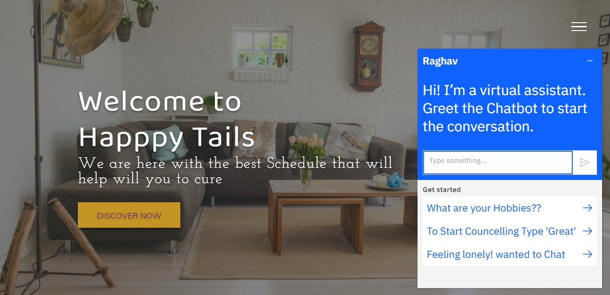

>The best way to cure depression, Melancholy, anxiety is to uplift the confidence and make their life colourful again. Based on this design principle our team has designed a dynamic webpage for people who need help in this rough patch of their life. 

>>After clicking on up right corner a list of tiles including home, about us, team, contact will slide to bottom. User can easily click on any one of these and will be redirected further. Along with this social media handles of our team has been provide for further support. 

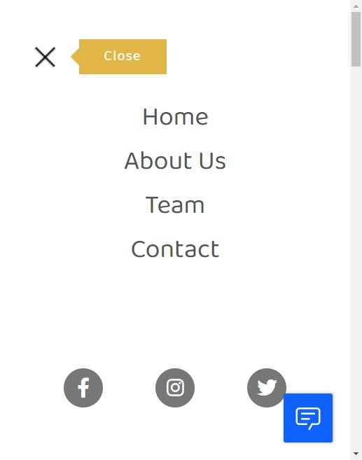

><span style="color: #f2cf4a; font-family: Babas; font-size: 1.5em;">1) **Home**:</span>Homepage of website has been designed keeping in mind that the person might be low at the moment, so to cheer him up a soft theme is presented. It is easy enough for beginner to get started with homepage. 

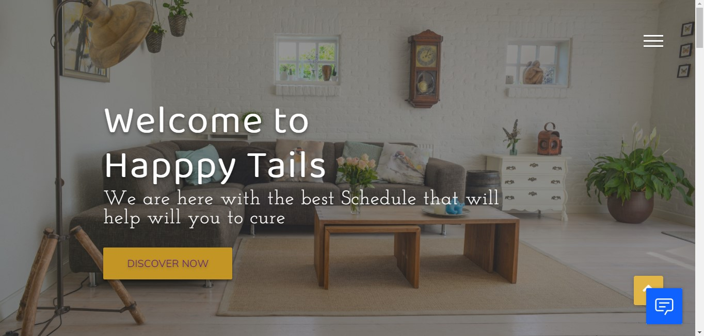

When you will click on **Discovery Now** you will be directed to our _monthly_ schedule.

>><span style="font-family: 'Lucida Console';">To start on a early and easy phase we have designed best suited four weeks schedule for the user. Following this schedule step wise will bring out the best change in you for your better. </span>


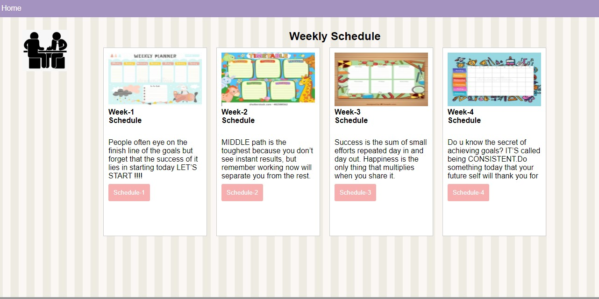

>>>A separate _schedule_ has been designed for each week .It is designed keeping in mind that main objective is to strengthen mental health of user by giving him tasks that have been recommended by doctors themselves. 

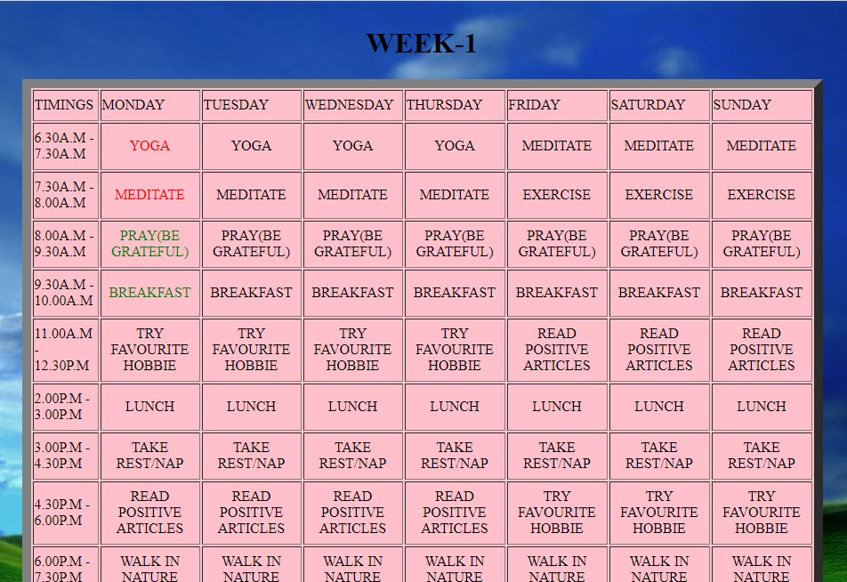

>>>As you click on a button i.e. cell of a time table (in schedule) a _pop-up_ question will ask you whether you have completed the task or not. Once user has completed the given task colour of cell will change as to keep a record of tasks that are done and that have been missed.

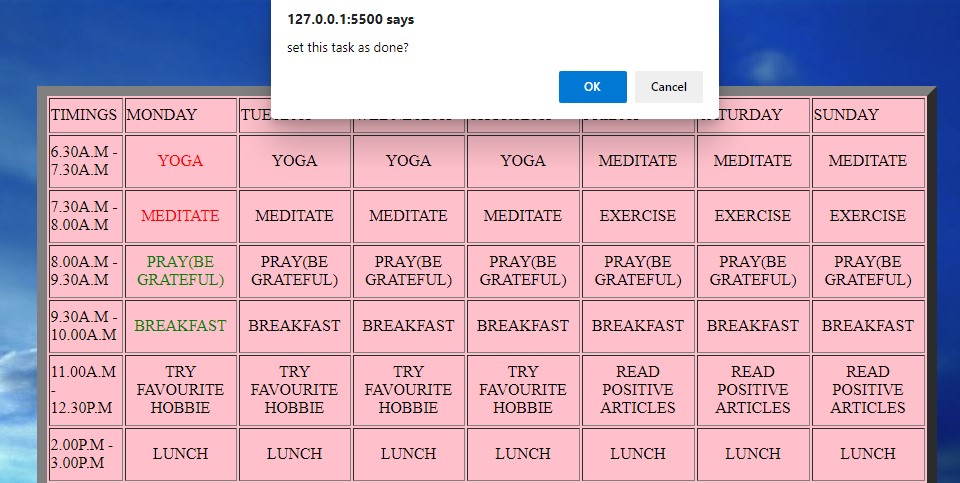

- [x] ***Complete Task*** - Green Colour
- [ ] ***Incomplete Task***-Red Colour

----
><span style="color: #f2cf4a; font-family: Babas; font-size: 1.5em;">2) **About Us**:</span>
Scrolling homepage further will give a brief description **about** our team. Our main objective is to bring out best confident personality from within you , and lend a helping hand ,which has been explained in this section of webpage. 

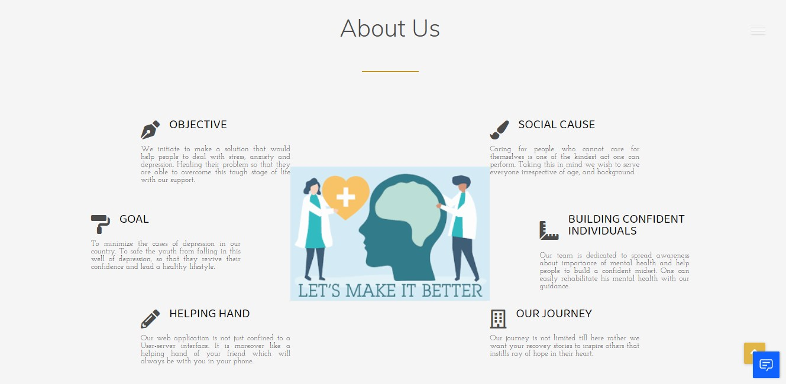

----

><span style="color:gold; font-family: Babas; font-size: 1.5em;">3) **Team**:</span>Scrolling a bit further you will finally reach virtually to us and we are glad for that. A brief description about our team along with our profile has been mentioned. 

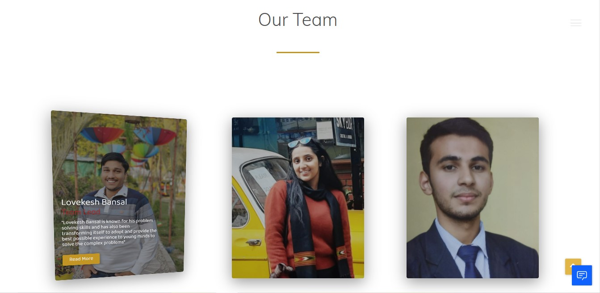

----

><span style="color:gold; font-family: Babas; font-size: 1.5em;">4) **Contact**:</span>If your needs are not satisfied by this webpage or you have queries unanswered,you surely can contact us personally and we ensure you to provide with best solution. 

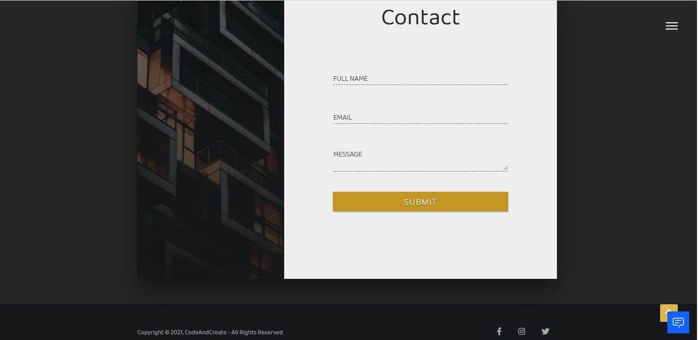

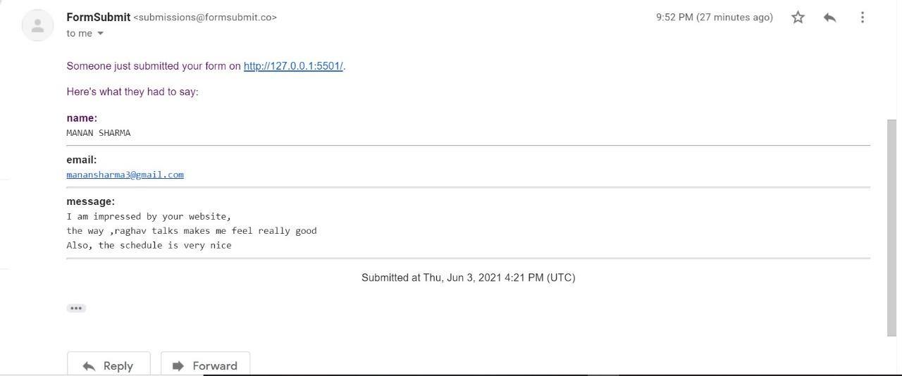

----

<span style="color:#fff; font-family: 'Bebas Neue'; font-size: 1.1em;">Now comes the heart of our webpage that is <span style="color: #f2cf4a; font-family: Babas; font-size: 1.1em;">Chatbot</span> named ***Raghav***. Your friend that stands with you in all situations and uplift your mood and revive your broken confidence. Based on artificial intelligence this bot is a complete solution to analyse your mood and one can have a full fledged counselling session.</span>

----

<span style="font-family: times, serif; font-size:11pt; font-style:italic">Click on the 
[Link](https://drive.google.com/file/d/1CXnzpZCOaGdLIogPopiNcQ4GtadVNMoc/view?usp=sharing)
to check the demo of the Chatbot</span>

----

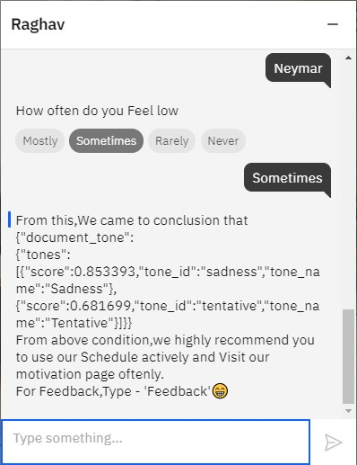

After counselling session a hand to heart interaction, bot will suggest best for you. _This will be done by analysing the range of depression one is going through with the help of Tone Analyzer i.e being integrated with IBM watson assistant._ Treatment will be further directed after the response from user. 

----


